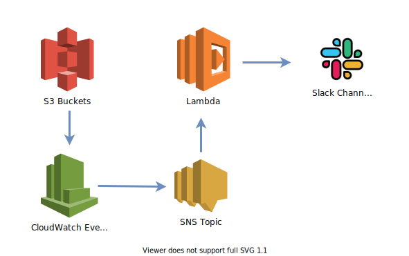

# Simple S3 DLP

This is a tool to monitor unauthorized or unexpected data transfer from S3 buckets in your org to an external account. It works by triggering CloudWatch rules generated by S3 API `CopyObject` events. These events are then sent to an SNS Topic, which in turn invoke a Lambda function to parse the event and send a Slack notification if objects were copied to an external account.

### Setup

The step-by-step setup instructions can be found in [this blog post](https://darkbit.io/blog/2020/02/18/simple-dlp-for-amazon-s3).
